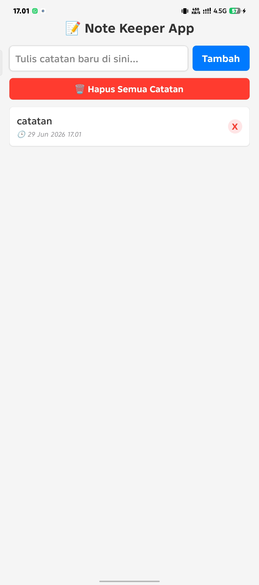
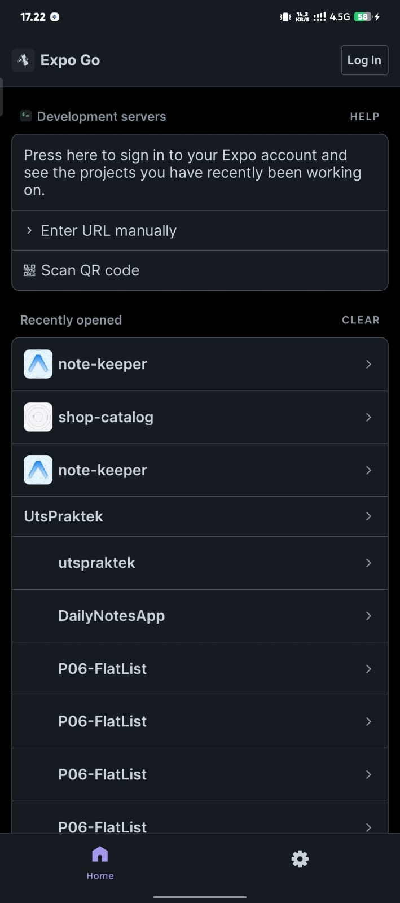
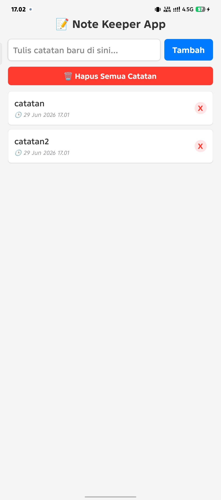

# 📝 NoteKeeper — Task & Note Management App with AsyncStorage

Aplikasi manajemen catatan dan tugas harian berbasis mobile yang dibangun menggunakan **React Native** dan **Expo Framework**. Proyek ini dibuat untuk memenuhi tugas **Topik 12** dengan fokus utama pada implementasi **Penyimpanan Data Persisten Lokal menggunakan AsyncStorage**, penanganan operasi **CRUD** penuh, serta pengoptimalan *User Experience* (UX).

Aplikasi ini telah diuji langsung pada perangkat fisik (*Physical Device*) dan dikembangkan dengan struktur kode yang siap dipajang sebagai portofolio GitHub profesional.

---

## 📝 Deskripsi Aplikasi & Cakupan Fitur

NoteKeeper memungkinkan pengguna untuk mencatat, melihat, memperbarui, dan menghapus data secara lokal. Dengan integrasi `AsyncStorage`, seluruh data yang diinput oleh pengguna akan diubah menjadi format JSON dan dikunci ke dalam memori internal perangkat, sehingga data **tidak hilang** meskipun aplikasi ditutup total (*force close*).

Berikut adalah status pemenuhan kriteria fitur sesuai modul instruksi:

### 🌟 Level 1 — Fitur Wajib (Core)
* [x] **CREATE:** Menambah item catatan/tugas baru melalui `TextInput` dengan validasi ketat (menolak input kosong atau spasi saja).
* [x] **READ:** Memuat ulang data secara otomatis saat aplikasi pertama kali dibuka memanfaatkan perpaduan `useEffect`, `JSON.parse()`, dan pengisian komponen state.
* [x] **DELETE:** Menghapus item tertentu dari daftar dengan metode array `filter()` yang langsung disinkronisasikan ke storage.
* [x] **Auto-Sync Storage:** Mengotomatiskan proses penulisan ulang ke `AsyncStorage` menggunakan `JSON.stringify()` setiap kali ada perubahan data (*state dependency*).
* [x] **FlatList Rendering:** Menampilkan seluruh daftar item secara efisien menggunakan komponen `FlatList` lengkap dengan optimasi `keyExtractor`.
* [x] **Empty State UI:** Memanfaatkan properti `ListEmptyComponent` pada FlatList untuk menampilkan pesan informatif ketika daftar catatan masih kosong.
* [x] **Proven Persistence:** Teruji 100% data tetap utuh dan tersedia setelah aplikasi di-*kill process* atau perangkat di-boot ulang.

### 🟡 Level 2 — Pengembangan (Dipilih Minimal 2)
*Pilih fitur yang kamu aktifkan di bawah ini dengan memberikan tanda `[x]` :*
* [x] **✏️ UPDATE / Edit / Toggle Status:** Mekanisme `map()` untuk mengubah status tugas (selesai/dicoret) atau memperbarui teks isi catatan yang sudah ada.
* [x] **🗑️ Konfirmasi Hapus:** Menampilkan pop-up `Alert` konfirmasi native Android/iOS sebelum sistem benar-benar menghapus item untuk mencegah ketidaksengajaan.
* [ ] **🌙 Dark Mode Tersimpan:** Fitur toggle tema (Terang/Gelap) yang preferensinya disimpan pada key AsyncStorage terpisah dan dimuat otomatis saat *startup*.
* [ ] **🔎 Search / Filter:** Penyediaan komponen `TextInput` pencarian untuk menyaring item catatan secara *real-time* di memori RAM.
* [ ] **📊 Statistik Tersimpan:** Komponen counter untuk menghitung total catatan yang dibuat vs selesai dan nilainya persisten.
* [ ] **🧹 Hapus Semua:** Tombol akselerasi untuk membersihkan semua data pada key catatan khusus tanpa mengganggu konfigurasi storage lain.

### 🔴 Level 3 — Tantangan Bonus (Opsional / Nilai Tambah)
* [x] **🕒 Timestamp:** Menyimpan data waktu pembuatan atau penyuntingan secara otomatis menggunakan `new Date()` dan menampilkannya pada tiap kartu catatan.
* [ ] **🏷️ Kategori / Tag:** Pengelompokan tugas berdasarkan rumpun tertentu (Work, Personal, Study) beserta filternya.
* [ ] **🔄 Sorting:** Fitur pengurutan item (berdasarkan abjad, tanggal terbaru, atau status penyelesaian).

---

## 🛠️ Tech Stack & Modul

* **Core Framework:** React Native (Expo Managed Workflow)
* **Local Storage:** `@react-native-async-storage/async-storage`
* **Language:** JavaScript (ES6+)
* **Styling Engine:** React Native `StyleSheet` dengan pendekatan layout Flexbox.

---

## 📱 Bukti Pengujian (Screenshot HP Fisik)

> *Catatan internal: Ganti berkas gambar di bawah ini dengan tangkapan layar asli dari HP-mu sebelum di-push ke GitHub.*

### 1. Halaman Utama & Form Input (CREATE & READ)
Menampilkan komponen pengisian catatan baru, tombol simpan, serta tampilan daftar menggunakan `FlatList` yang rapi. Jika data kosong, komponen *Empty State* akan muncul.



### 2. Bukti Persistensi Data (Sebelum & Sesudah Tutup Aplikasi)
Pengujian validasi bahwa data yang disimpan tidak hilang dari `AsyncStorage` ketika aplikasi dimatikan paksa dari latar belakang dan dijalankan kembali.

| Keadaan Sebelum App Ditutup | Keadaan Setelah App Dibuka Kembali |
| :---: | :---: |
|  |  |

---

## 🚀 Cara Menjalankan Aplikasi

### 1. Uji Coba Instan via Expo Snack
Kamu bisa menjalankan dan melihat kode serta demo aplikasinya secara langsung tanpa instalasi lokal melalui tautan berikut:  
🔗 **[Buka Proyek di Expo Snack](https://snack.expo.dev/@diko-dev/funny-orange-cheese)**

### 2. Menjalankan di Komputer Lokal

```bash
# 1. Clone repositori ini ke komputer kamu
git clone [https://github.com/username-kamu/notekeeper-asyncstorage.git](https://github.com/username-kamu/notekeeper-asyncstorage.git)

# 2. Masuk ke direktori proyek
cd notekeeper-asyncstorage

# 3. Install seluruh dependency package yang diperlukan
npm install

# 4. Jalankan server pembangunan Expo
npx expo start